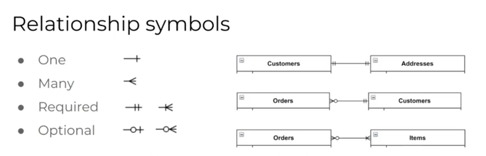

# Databases

### Background

##### What is a Database?

A database is an **organised** and **structured** collection of related data. Databases allow for **data** to be used as **information** by collecting and storing the data in a **meaningful** way. Databases are typically accessed via a **DBMS** (Database Management System).

##### Data vs Information

|Data|Information|
|:-:|:-:|
|Raw, unfiltered, unrelated material that can be in any format such as text, images, numbers, etc. <br> Data is **meaningless**. |Collected and related data that has been **analysed**. <br> Information delivers **meaning**.|

##### Non-Relational Databases

Non-relational databases uses **collections** and **documents** to organise data.

**Collections** are the equivalent of **tables**.
**Documents** are the equivalent of **rows**.
i.e. **Collections contain documents**.

Data **attributes** are defined but loosely structured.

- Tip: Some **documents** might have attributes that others don't.

``` Ruby
{
  name: duck
  description: rubber duck
  price: 5
},
{
  name: kitty
  description: cat statue
  price: 8
  discount: 0.1
}
```

### Relational Databases

Relational databases organise data in **tables** with **rows** and **columns**.

Each **entity** will have its own separate **table**. **Instances** of each entity are the **rows** in each table.

|Feature|Purpose|Description|
|:-:|:-:|:-:|
|Table|Relation|Defines how data **relates** to information.|
|Column|Attribute|Defines attributes of the data. Also known as **domains** or **types**.|
|Row|Record|Represents individual **records** in the table. Also known as **tuples**.|

**Example - Products Table**
|Name|Description|Price|
|:-:|:-:|:-:|
|Duck|Rubber Duck|5|
|Kitty|Cat Statue|8|

- **Table** - Products
- **Attributes** - Name, Description, Price
- **Rows** - Duck, Kitty (and their other attributes)

**Common RDBMS (Relational Database Management Systems)** include:
- PostgreSQL
- MySQL
- Microsoft SQL Server
- Oracle Database Cloud

##### Database Schema

The **database schema** is its structure described in a formal language supported by the database management system (DBMS). The term "schema" refers to the organization of data as a **blueprint** of how the database is constructed (divided into **database tables** in the case of relational databases).


##### Data Modelling

Robust modelling is critical to solving a data problem. It involves identifying the **entities** or **objects** and their underlying **attributes**.

- Items
  - Name
  - Description
  - Price
- Customers
  - Name
  - Email
  - Address
- Orders
  - Date
  - Customer
  - Items with quantities
  - Total price

#### Keys

Each **tuple** or record in a table has constraints that must be met for instances of the relation to be **valid**.

##### Candidate Keys

Every row has a **candidate key**, which is just a unique identifier for the tuple (all tuples must be uniquely identifiable).

e.g. `customer_id`, `order_id`

##### Primary Keys

A **primary key** is typically declared and can consist of one or more attributes (columns).

e.g. 

- Items
  - Item Name
- Customers
  - Name and Email
- Orders
  - Items

*Entity Integrity Rule* - Primary keys should **NOT be NULL**.

##### Foreign Keys

A **foreign key** is an attribute (column) in one relation (table) that serves as a candidate key in another relation (table).

*Referential Integrity Rule* - If a relation refers to a key attribute of another (or the same) relation, that key element **must exist**.

#### Data Model Refinement

Data models must be refined by **removing anomalies** and **improving query efficiency** (**normalisation**).

e.g.
- How would items be edited in the existing order?
- How would addresses store all of the required information?

#### Database Design

Database design is a crucial part of developing the back-end of any application. There are entire professions devoted to developing robust databases in which data can be stored and accessed efficiently without errors.

#### Normalisation

[Normalisation Explained](https://www.essentialsql.com/get-ready-to-learn-sql-database-normalization-explained-in-simple-english/)

The goal of normalisation is to improve efficiency and ensure data integrity. This achieved by:

- Minimising **duplication** (same data in multiple tables or columns).
- Avoiding **modification anomalies** such as:
  - **Update** anomaly - an attribute is updated in one table but not all tables.
  - **Delete** anomaly - only a part of an entity is deleted.
  - **Insert** anomaly - when we attempt to insert data into a **missing** record.
- **Simplifying** queries.

#### Normal Forms

Normal forms are used to normalise our table schema, making them less prone to **modification anomalies**, **separate concerns** by purpose or topic, and to make it easier to query the data.

The are **three** basic normal forms, each built on the previous one:

##### First Normal Form **(1NF)** Rules:
  - Column names must be **unique** even **across tables**.
  - **Order** of records doesn't matter.
  - Records of one column must be of the **same type**.
  - Columns must have **single values only** (atomic values).

**Customers**
|name|email|address|
|:-:|:-:|:-:|
|Sharon Teel|sharon@abc.com|5 Simpson Way, Brisbane, QLD, 4000|

- The above table **breaks** the first normal form - Address has multiple values.
- This will make it difficult to query customers in a particular state or city.
- It also makes it difficult to ensure data integrity, e.g. making sure that the suburb and postcode match.
- See below for a better example.

|name|email|street_number|street_name|suburb|state|postcode|
|:-:|:-:|:-:|:-:|:-:|:-:|:-:|
|Sharon Teel|sharon@abc.com|5|Simpson Way|Brisbane|QLD|4000|

##### Second Normal Form **(2NF)** Rules:
  - Table must be in **1NF**, i.e. it fits the first normal form.
  - All **attributes/columns** depend on the table's **primary key**.

**Customers**
|name|email|street_number|street_name|suburb|state|postcode|
|:-:|:-:|:-:|:-:|:-:|:-:|:-:|
|Sharon Teel|sharon@abc.com|5|Simpson Way|Brisbane|QLD|4000|
|Mike Anthony|manthony@gg.com|819|Hart Ct|Sydney|NSW|2000|

In the above table - the primary key is the customer **name**.

Since the addresses do not **describe** the customer, they belong in another table and should be linked to the **customers** table.

This gives each table a **single purpose** and enables a **separation of concerns**.

**Customers**
|customer_id|name|email|
|:-:|:-:|:-:|
|1|Sharon Teel|sharon@abc.com|
|2|Mike Anthony|manthony@gg.com|

**Addresses**
|id|street_number|street_name|suburb|state|postcode|customer_id|
|:-:|:-:|:-:|:-:|:-:|:-:|:-:|
|1001|5|Simpson Way|Brisbane|QLD|4000|1|
|1002|819|Hart Ct|Sydney|NSW|2000|2|

The above tables now have a **distinct purpose** and are related with the attribute **customer_id**.

##### Third Normal Form **(3NF)**
  - Table must be in **2NF**, i.e. it fits the second normal form.
  - It contains only columns that are **non-transitively dependent** on the **primary key**.

**Addresses**
|id|street_number|street_name|suburb|state|postcode|customer_id|
|:-:|:-:|:-:|:-:|:-:|:-:|:-:|
|1001|5|Simpson Way|Brisbane|QLD|4000|1|
|1002|819|Hart Ct|Sydney|NSW|2000|2|

In the above table, the *postcode* is **dependent** on the suburb which forms a **primary key**.
However, since the *state* is dependent on the *postcode* which is dependent on the **primary key**, i.e. *postcode* dictates the *state* - the *state* is **transitively dependent** on the **primary key**.

Problem - **Update Anomalies** - e.g. if the postcode was updated but the state wasn't, there would now be a mismatch in the data and its integrity has been jeopardised.

**Addresses**
|id|street_number|street_name|suburb|state|customer_id|
|:-:|:-:|:-:|:-:|:-:|:-:|:-:|
|1001|5|Simpson Way|Brisbane|4000|1|
|1002|819|Hart Ct|Sydney|2000|2|

**Postcodes**
|postcode|state|
|:-:|:-:|
|4000|QLD|
|2000|NSW|

[Further Reading - Transitive Dependencies](https://www.lifewire.com/transitive-dependency-1019760)

#### Unnecessary Normalisation

It's important to ensure that normalisation doesn't go too far - with unnecessary extra tables and complicated relationships which don't serve any purpose.

There is a tradeoff between complexity, performance, data integrity, and query simplicity and efficiency when considering how far to take normalisation. 

Identify areas of risk of anomalies considering your use of the data and use normalisation to eliminate them

Consider how you will query and use the data, and use normalisation to make it easier and faster

- Tip: Data structures could be modelled around the **user stories** to more effectively solve problems.

### Commands

#### Manipulative features 

- select, insert, update, delete

The manipulative features of relational databases provide the ways we access and modify the data.

##### Select

Returns a relation containing all tuples (records) that meet some condition. In PostgreSQL, we use the SELECT statement for this, with optional clauses to limit the results.

Examples:

SELECT * from items WHERE name = ‘ducky’;

SELECT * from items WHERE price < 10.00 LIMIT 10;

SELECT name from items;

SELECT quantity, item from orders;

##### Insert

Add rows to a table with INSERT.

Example: 

INSERT into items
values (‘frog’, ‘great jumper’, 5.00);

##### Delete

Remove rows from a table with DELETE.

Example:

DELETE from items
WHERE name = ‘ducky’;

##### Update

Update rows in a table with UPDATE.

Example: 

UPDATE items
SET price = 4.50 WHERE name = ‘frog’;

### Relationships

Relationships refer to the associations between entities (tables). These define how records in one table relate to records in another.

**Example**
- Items
  - Name
  - Description
  - Price
- Customers
  - Name
  - Email
  - Address
- Orders
  - Date
  - Customer
  - Items with quantities
  - Total price

How is a customer associated with an order?
- A customer places an order

How is an item associated with an order?
- An order contains at least one item

##### Cardinality and Ordinality

Cardinality refers to the **maximum** number of one entity with which an entity relates:

- An order is made by one customer (one)
- An order can contain many items (many)

Ordinality refers to the **minimum** number of one entity with which an entity relates:

- A customer can have 0 orders (**optional** relation)
- An order contains at least one item (**manadatory** relation)

##### One to One

A **one to one** relationship refers to an association where records in one entity only relate to one record in another entity.

Example
- A customer only **has one** address and one address **belongs to** only one customer.

##### One to Many

A **one to many** relationship exists when one record **has many** associations with other records.

Example
- An order has exactly one customer.
- A customer has 0 or more orders.

It is **mandatory** for an order to have a customer and **optional** for a customer to have an order.

##### Many to Many

A **many to many** relationship exists when a record **has many** associations with another record and vice versa.

Example
- An order can have many items.
- An item can belong to many orders.

##### Relationship Symbols



#### Entity Relationship Diagrams

Entity Relationship Diagrams (or **ERDs**) help visualise the relationships between entities in a database.

There are typically three types of ERDs, representing different levels of abstraction:

- **Conceptual**
- **Logical**
- **Physical**

##### Resources

Licensed ERD Tools
- Smartdraw.com
- Lucidchart.com

Free ERD Tools
- Diagrams.net

##### Physical ERDs

A physical ERD represents how data is **physically** modeled in the database. It can include:

- Attribute types
- Keys and constraints
- Relationships

Physical ERDs represent **schemas** for database tables and can be used to directly inform how tables should be created.

##### ERD Process

ERDs generally form part of the design process of an application - occurring before implementation.

Some or all optimisation (including normalisation) of the data model may be done before physical ERDs are created.

Sometimes, an ERD is created from a database - such as when designing over an existing code base or existing database.

