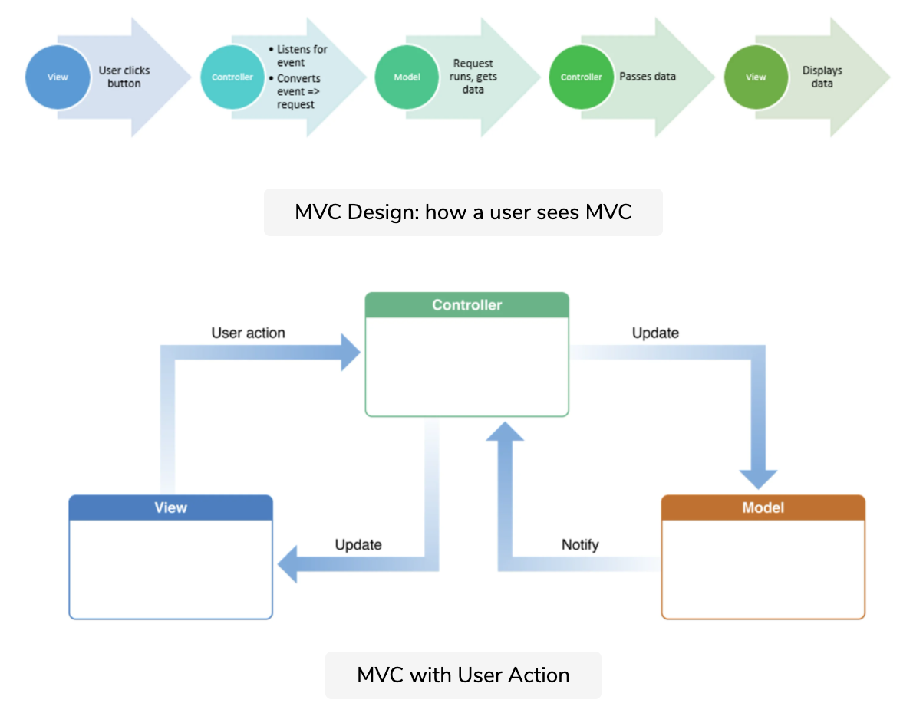

# Model-View-Controller

### Resources
https://www.educative.io/blog/mvc-tutorial

### Background

Model View Controller is a design pattern used in application development with a number of different languages. The structure is broken down into three main parts, each part serving a specific function - providing **modularity**. Frameworks like **Rails** can take advantage of this convention to automate many aspects of building, running and updating the application.

### Model

The **model** represents and manages the **content** or **data** in the application - responsible for connecting to the **database** and **retrieving** and **modifying** the content.

It defines the data **structure** and **relationships** of the content.
The model is also responsible for doing some **validation** of the data.

### View

The **view** is the interface for the application user.
It is responsible for displaying content from the **model** to the user, and allows the user to **interact** with the content.

### Controller

The **controller** is the brain or **orchestrator**. The **view** interacts with the **controller** to get content from the **model** to display and to update the content based on the user interaction.