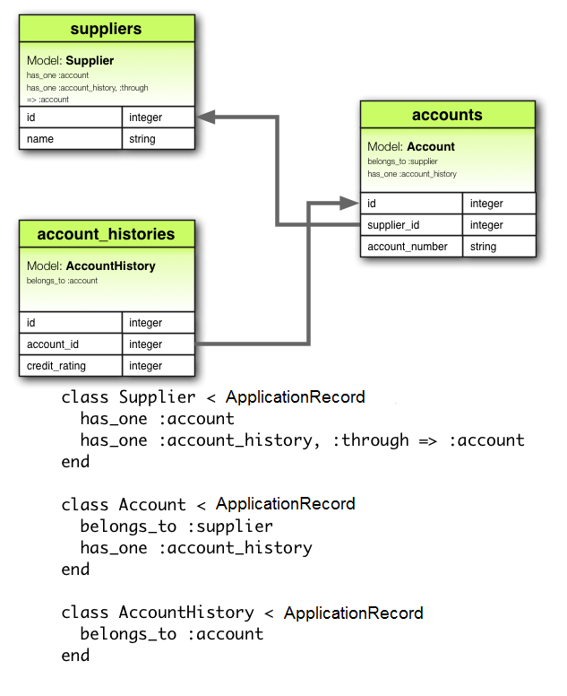
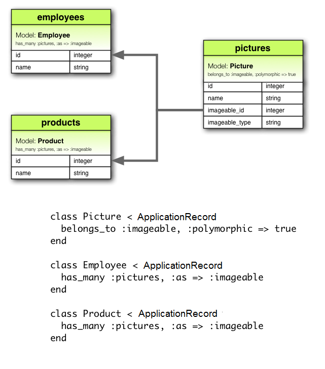

# Models

<hr>

### Models Walkthrough

#### Background

- Models represent the data in a Rails application.
- They allow the application to access the database using **Ruby methods**.
- **ActiveRecord** interprets Ruby commands and translates them to **SQL** in order to interact with the databases in the desired way.

- Models represent:
  - Models and their data
  - Associations between these models

- Rails helps validate models before they are **persisted** to the database.
- They allow for database operations to be performed in object-oriented fashion.

#### Generating a Model

``` Shell
rails g model <model name (singular)> <column_name:data_type{size}|{size,precision}>
```

**Sytnax**
- Models are generated with the rails `generate` command (`g` for short).
- Model names must be in **PascalCase** or **snake_case**.
- Model names must be **singular**.
- Multiple attributes/columns can be added if separated by a **space**.
- **Size** and **Precision** are optional.
- Default type is a **string**.

Example

``` Terminal
rails g model User name:string{30} age:integer group:references
```

##### Rails Files

- The `generate` command will create the necessary files for the Model, including <model_name>.rb and the **migration** file - which tells the database management system what commands to run to create the necessary tables.
- Once the model is generated, `rails db:migrate` must be run to create the schema in the database as specified by the migration file.

#### CRUD

##### Command Cheatsheet

`.all` => show all records.
`.find(#)` => find by index/id.
`.find_by(#)` => return the **first instance** satisfying the condition.
`.where(#)` => return **all instances** satisfying the condition.

`.<attribute_name>` => read or write a record to the attribute of the object.

`.save` => push changes made in Ruby/Rails to the database.
`.create()` => `.new` + `.save`
`.update()` => `.<attribute_name>` + `.save`

`.destroy` => destroy the record in the **DATABASE**.
`.destroy_by()` => destroy the record specified by the condition in the **DATABASE**
`.destroy_all` => destroy all records in the **DATABASE**.

##### Create

``` Ruby
user = User.create(name: 'Eddie', age: 31)

user = User.new
user.name = 'Eddie'
user.age = 31
user.save
```

- The above code has the same functionality.
- `create` will call both `new` and `save`.
- `new` will instantiate an object **without** saving.
- The object can be created from a hash.
- Methods named after columns will be added by Rails e.g. `.name` and `.age` - allowing the user to view/update the associated record.
- `save` will save the record to the database.

##### Read

``` Ruby
users = User.all

user = User.first
second = User.find(2)
eddie = User.find_by(name: 'Eddie')
smiths = User.where(last_name: 'Smith')
```

- `.all` will return every record in the table in an array-like collection.
- `.first` will load the first entry, similarly `.last` will load the last entry.
- `.find(#)` will find by the **id** specified.
- `.find_by(#)` will find by the attribute/column specified - returning the **first instance** where this is true.
- `.where(#)` will return a **collection** based on the condition specified.

##### Update

``` Ruby
user = User.find_by(name: 'Eddie')
user.name = 'Ed'
user.save

user = User.find_by(name: 'Eddie')
user.update(name: 'Ed')
```

- Rails will set an `attr_writer` for each attribute/column, allowing for their values to be **written** to.
- `.save` needs to be called to push any changes made in Ruby/Rails to the database.
- `.update` will automatically call `.save` and can also use a **hash** to update **multiple values**.

##### Delete

``` Ruby
user = User.find_by(name: 'Eddie')
user.destroy

User.destroy_by(name: 'Eddie')
User.destroy_all
```

- `.destroy` will destroy the record.
- `.destroy_by()` will destroy the record specified by the condition.
- `.destroy_all` will destroy all records.

- **Note** - these commands will automatically **DELETE** records from the **database** i.e. no `.save` required.

#### Associations

https://guides.rubyonrails.org/association_basics.html

Rails allows for associations to be declared between models/tables quickly using specific methods, depending on the required relationship.



##### Has One Relationship

`belongs_to`

This method is called in a Model to specify that each record **belongs to** a record in another model and it has a **foreign key** to link them.

`has_one`

This method specifies that each record of a model **has one** associated record in another model.

Note that naming has to be singular for both.

##### Has Many Relationship

`belongs_to`

Similar to the **has one relationship**, this specifies that each record in this model **belongs to** a record in another model and contains the **foreign key**. Naming is singular.

`has_many`

This specifies that a record in this model **has many** associations with records of another model.

Naming is **plural**.

##### Has Many Through Relationship

This relationship uses a **join table** to link two tables together - allowing for **many to many** relationships.


- Tip - Just like with Ruby, the `=>` symbol syntax can be shortened to `through: :appointments`.

##### Polymorphic Relationships

Polymorphic associations allow for different records to **belong to** different tables.

Example:

- **Comments** could belong to both **Users** and **Recipes**.
- **Reviews** could belong to both **Books** and **Authors**.

In order to achieve this, the polymorphic model would have two attributes referencing the models it can be associated with.

- **Users** and **Recipes** would be **commentable**. **Comments** would have an attribute of **commentable_type**, identifying the table it is referencing (**User** or **Recipe**) and a **commentable_id**, identifying the **id** of the **commentable type (user or recipe)**.



Example Polymorphic Generation Command
``` Ruby
rails g model Review reviewable:references{polymorphic} comment:string
```
### Migrations

https://guides.rubyonrails.org/active_record_migrations.html

"Migrations are a convenient way to alter your database schema over time in a consistent way. They use a Ruby Domain-Specific Language (DSL) so that you don't have to write SQL by hand, allowing your schema and changes to be database independent.

You can think of each migration as being a **new 'version' of the database**. A schema starts off with nothing in it, and each migration modifies it to add or remove tables, columns, or entries. Active Record knows how to update your schema along this timeline, bringing it from whatever point it is in the history to the latest version. Active Record will also update your db/schema.rb file to match the up-to-date structure of your database."

#### Rails Migrations

When a model is generated, Rails sets up a **migration file** which dictates how it will interact with the **SQL database** in order to build the **schema** as desired.

Example:
``` Ruby
class CreateProducts < ActiveRecord::Migration[6.0]
  def change
    create_table :products do |t|
      t.string :name
      t.text :description

      t.timestamps
    end
  end
end
```

In order to effect this migration, the user must run `rails db:migrate`.

`db:migrate` comes with several options for other migration functionality, such as `db:migrate:status` to see the status of migrations and more.

`db:migrate:rollback` can revert the changes applied to the database.

**schema.rb** is an auto-generated file representing the current state of the database. It should match the versions of the migrations files and **shouldn't be modified directly**.

- Tip - It can be faster and more reliable to run `rails db:schema:load` to define the database schema rather than running all the migrations especially if some of them are older and have **external dependencies**.

#### Generating Migrations

Migrations can be generated with rails commands to adjust the existing database schema.

Example
``` Terminal
rails g migration AddPriceToBooks price:integer
rails db:migrate
```

In the example above, we have used the **rails generate** command to generate a migration **AddPriceToBooks** to add the **Price attribute** with **data type - price**. We then run `rails db:migrate` to update the schema.

Note - Rails **infers** from the **migration name** what changes we want to make to the schema so it is **important** to get this right.

- "If the migration name is of the form "**AddColumnToTable**" or "**RemoveColumnFromTable**" and is followed by a list of column names and types then a migration containing the appropriate **add_column** and **remove_column** statements will be created."

``` Ruby
class AddPartNumberToProducts < ActiveRecord::Migration[6.0]
  def change
    add_column :products, :part_number, :string
  end
end
```

##### Change Methods

https://guides.rubyonrails.org/active_record_migrations.html#using-the-change-method

- add_column
- add_foreign_key
- add_index
- add_reference
- add_timestamps
- change_column_default (must supply a :from and :to option)
- change_column_null
- create_join_table
- create_table
- disable_extension
- drop_join_table
- drop_table (must supply a block)
- enable_extension
- remove_column (must supply a type)
- remove_foreign_key (must supply a second table)
- remove_index
- remove_reference
- remove_timestamps
- rename_column
- rename_index
- rename_table

### Model Methods

##### Validations

https://guides.rubyonrails.org/active_record_validations.html

Validations help ensure that only **valid** data is saved to the **database** - e.g. checking that a valid **email address** has been submitted.

These types of validations are said to occur at the **application/model level**. Performing these validations on the **front-end** is useful because it can prevent **unnecessary** requests to the server.

Example -
``` Ruby
class Book < ApplicationRecord
  validates :title, presence: true
  validates :description, length: { minimum: 10, too_short: "Please enter at least %{count} characters!" }
end
```

``` Terminal
book = Book.create(name: "Harry Potter", description: "You're a wizard, Harry!").valid?
=> true
book = Book.create(name: "Hunger Games", description: "Yum").valid?
=> false
book.errors.full_messages
=> ["Please enter at least 10 characters!"]
```

- Tip - `.errors.full_messages` will provide an array of the **error messages** in full - helpful for **debugging**.

- Tip - There are certain methods which [skip validations](https://guides.rubyonrails.org/active_record_validations.html#skipping-validations) and should be used with caution.

##### Scopes

Scopes are a way to specify **commonly-used queries** which can be called as **methods** in **models**.

``` Ruby
class Book < ApplicationRecord
  scope :bargain, -> { where (price: 0..500) }
end
```

The above example creates a method called `bargain` which can be called on a **Book object** which will **return** all records **where** price is between 0 and 500.
