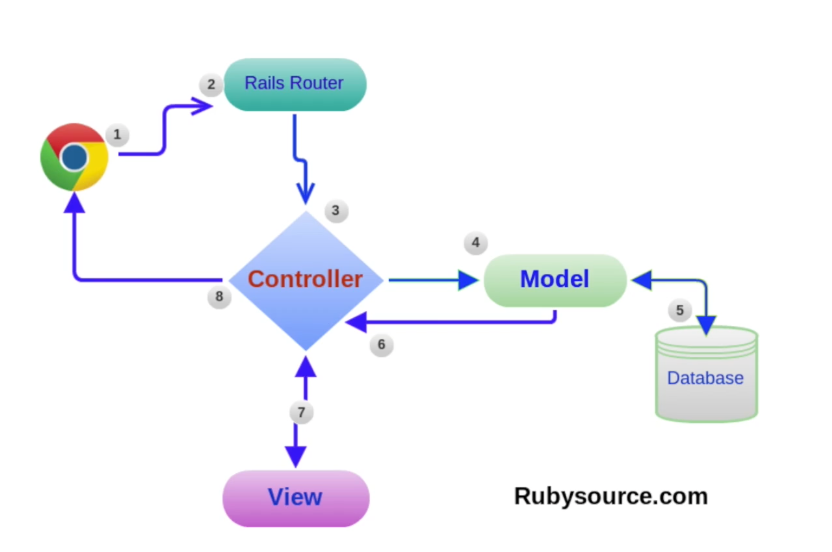
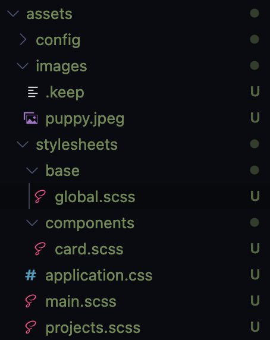

# Views

<hr>

### Views Walkthrough



Views are rendered using the **corresponding layout** to the controller that Rails can find in app/views/layouts. If it doesn't find the specific layout related to the controller it will use the default - **application.html.erb**. These views use **yield** to fetch the content to be displayed on the webpage.

#### Embedded Ruby Files

In Rails, HTML isn't used directly to code the content in the browser - instead, we use **embedded ruby** files. These files allow us to insert **Ruby code** into our views, which lets us embed **logic** in our HTML files.

- Tip - Only **instance variables** can be accessed from **controller actions** by the embedded ruby files.

##### Syntax

`<% %>` - 'ice cream cone' tags - used to specify Ruby code within embedded ruby files.

`<%= %>` - string interpolation tags - like native Ruby's `#{}`.

#### Rendering

There are two main ways that information can be rendered by the client:
- Explicit rendering - where the `render` method is used to render html/json directly from the controller, or a `symbol` is passed to the `render` method, referencing the specific view (HTML embedded Ruby file) to be rendered. This file should have the **same name** as the controller by **convention**.
- Implicit rendering - Rails will automatically render the .**erb** **view file** with the same name as the controller by convention.

``` Ruby
# Explicit rendering
render html: "<h1>hello world</h1>".html_safe
render json: { "hello" => "world" }
render plain: "hello world"
render :index # index.html.erb
```

##### link_to

The `link_to` method can be used in **embedded ruby files** to create a link to another page.

``` Ruby
  # Argument 1 is the text for the link
  # Argument 2 is the link itself
  # 'project' in project_path is the http prefix - /project/:id
  # we pass the relevant project id to this route
  <%= link_to project[:name], project_path(project[:id]) %>
```

#### Partials

**Partials** are a chunk of HTML which are defined **once** and used in multiple files, in the interest of enabling the **DRY** principle.

Uses for **partials** include repeated elements such as - navbars, footers, etc.

##### Partial Convention

Shared **partial** elements go in **/views/shared** and are prefixed with an **underscore** e.g. **_nav.html.erb**.

In this example, we add the **shared nav bar** at the top of the HTML **body** in the **application.html.erb** layout file which uses **yield** to display all the content in each respective **.html.erb** file requested.

**application.html.erb layout**
``` Ruby
<!DOCTYPE html>
<html>
  <head>
    <title>ProjectsManagementAppViews</title>
    <meta name="viewport" content="width=device-width,initial-scale=1">
    <%= csrf_meta_tags %>
    <%= csp_meta_tag %>

    <%= stylesheet_link_tag 'application', media: 'all', 'data-turbolinks-track': 'reload' %>
    <%= javascript_pack_tag 'application', 'data-turbolinks-track': 'reload' %>
  </head>

  <body>
    <%= render partial: "shared/nav" %>
    <%= yield %>
  </body>
</html>
```

**_nav.html.erb shared partial**
``` Ruby
<nav>
  <%= link_to "Projects", projects_path %>
  <%= link_to "New Project", project_new_path %>
</nav>
```

- Tip: Partials related to a particular view can be rendered without the **partial:** argument identifier.

``` Ruby
<%= render "card" %>
```

- Tip: In order to pass a variable through to a partial, one must use **locals:** and a **hash** to specify the object being passed through to the partial. Further, the **partial:** element needs to be used.

``` Ruby
<% @projects.each do |project| %>
  <%= render partial: "card", locals: { project: project } %>
<% end %>
```

#### Asset Pipelines

The asset pipeline handles **static assets** like CSS files and images. The general purpose of the asset pipeline was to **compress** the static assets.

- Tip: Images/Stylesheets go into their respective folders in **/assets**.

Example - rendering an **image** from **/assets/images** in a view with a specified **width**.
``` Ruby
<%= image_tag asset_path("puppy.jpeg"), width: 200 %>
```

#### CSS, SASS

Rails app **stylesheets** are stored in **/assets/stylesheets**. The main file is **application.css** which is the entry-point for all the other CSS and SASS files to be loaded through.

By default, Rails' **application.css** file will require the **tree** of scss files in the directory - `require_tree`. Alternatively, a developer could define a single file such as **main.scss** and use `require main` to bring that into the asset pipeline. Then, the **main.scss** file itself, would **import** the other stylesheets.



**application.scss**
``` CSS
/*
 *= require main
 *= require_self
 */
```

**main.scss**
``` CSS
@import "/base/global";
@import "/components/card";
```

**base/global.scss**
``` CSS
body {
  font-family: sans-serif;
}

a {
  text-decoration: none;
  color: green;
}
```

**component/card.scss**
``` CSS
.card {
  border: 1px solid red;
}
```

<hr>

### Forms


#####