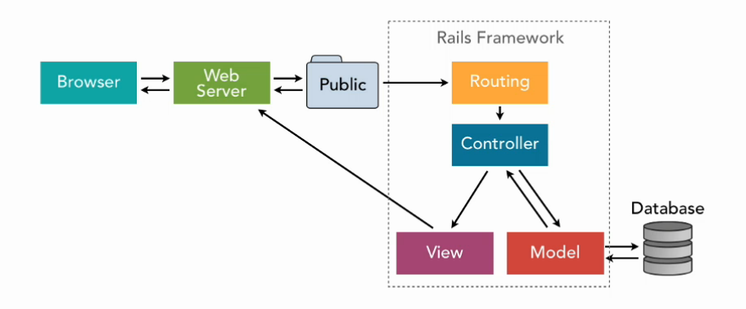
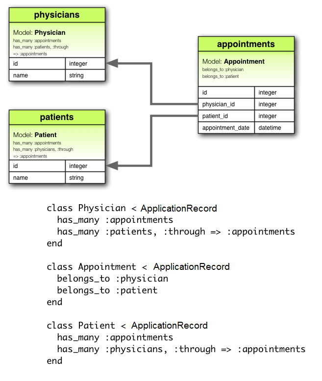

# Ruby on Rails

### Resources

##### Top 10 Mistakes in Rails

https://www.toptal.com/ruby-on-rails/top-10-mistakes-that-rails-programmers-make

##### State of Rails in 2021

https://scoutapm.com/blog/state-of-ruby

##### Sensitive Data Handling

https://ankane.org/sensitive-data-rails

##### Guides

https://www.codecademy.com/learn/learn-rails/

https://guides.rubyonrails.org/

https://medium.com/the-renaissance-developer/ruby-on-rails-http-mvc-and-routes-f02215a46a84

https://stackshare.io/rails

### Background

Ruby on Rails is a framework created in 2003 by **David Heinemeier Hansson** while working on **BaseCamp**, a project management tool. He developed tools to automate repetitive tasks while at BaseCamp and these formed the basis of Rails.

Rails was released as open source code in July 2004. It follows three basic principles:

- Based on the **Ruby** Programming Language.
- Model-View-Controller Architecture.
- Programmer Happiness.

Rails helps people build quick flexible **Minimum Viable Products** (MVPs) for market validation. However large tech companies such as Twitter have switched from Rails to other frameworks which are more performant at scale.

#### DRY

Rails follows the coding best practice principle of **Don't Repeat Yourself* (DRY), minimising the amount of repeated code which users will have in their programs.

#### Boilerplate Code

Boilerplate code is a unit of code that can be reused in many places with little to no alteration.
e.g. HTML initial layout template code.

Rails' built-in commands generate **boilerplate** code so programmers don't have to write them every time they want to create a new app or add/update features in their existing apps.

#### Convention over Configuration

Convention over Configuration is a design paradigm in programming which forms the philosophy of Ruby on Rails. It involves attempting to **decrease the number of design decisions** that the developer has to make without necessarily sacrificing flexibility. It is related to other programming concepts such as **sensible defaults** and the **principle of least astonishment** in UI design.

In practice, the developer adapts to the **convention** of the framework as much as possible, only explicitly specifying when they must deviate from the convention, i.e. **configure** the framework.

e.g. a Class called **Sales** would, by convention, have a corresponding table in the database called **sales**. It is only if one deviates from this convention, such as the table **product sales**, that one needs to write further code to refer to these names.

This paradigm requires a greater learning curve as the developer becomes more familiar with the convention. it may also conflict with other programming design principles such as Zen of Python's **explicit over implicit**.

<hr>

### Rails Architecture




#### Response Request Cycle


#### Directory Structure


#### Routes

Routes are a key part of all websites. Website content is organised into many different URLs (Universal Resource Locators). Each of these URLs and HTTP methods (GET, POST, PUT/PATCH, DELETE) require different routes to point to the correct content.

#### HTTP Requests

HTTP refers to the Hypertext Transfer Protocol which is the predominant protocol that computers use to communicate to each other over the Internet. A protocol can be defined as **a set of rules** for how messages are **formatted, transmitted and responded to**.

Any time a user wants to interact with the website, they have to send a request. If the request is valid, and the user has permission to send that request, then the website should send a response in return.

HTTP uses different **verbs** or **methods** to describe its requests:

|HTTP Verb|Action|
|:-:|:-:|
|GET| Retrieve a resource (Read)|
|POST| Create a resource |
|PUT/PATCH| Update a resource |
|DELETE| Destroy a resource |

These are also known as **CRUD** operations - **Create, Read, Update, Delete**.

##### HTTP Responses

https://developer.mozilla.org/en-US/docs/Web/HTTP/Status

HTTP response status codes indicate whether a specific HTTP request has been successfully completed.

Responses are grouped in five classes:
- Informational responses (100–199)
- Successful responses (200–299)
- Redirects (300–399)
- Client errors (400–499)
- Server errors (500–599)

The most common responses include: 
- `200` - **OK** - Server request succeeded.
- `404` - **Not Found** - The server could not find the requested resource. In the browser, this means the URL is not recognized.
- `500` - **Internal Server Error** - The server encountered a situation it could not handle.

#### Process Flow

1. **Client** sends an **HTTP request**.

When a user types a **URL** in the browser, the URL points to a running Rails **server**, which reads the **path** and looks for a **route**.

2. **Routes** connects **URLs** to **Controller Actions**.

Routes are defined in **config/routes.rb**. These routes **map** the **HTTP verbs and paths** to the app's **Controller Actions**.

3. **Controller** executes action and renders **View**.

The specified **Controller Action** will be activated and interact with the specified **Model**, providing information to the **View** via **instance variables**, as dictated with the HTTP request.

The controller will **render** the **View** with the appropriate information from the **Model** and the rendered content is sent to the client (the browser).

By default, the **View** that is rendered will be in the **Views** directory and should have a **name** that matches the **Controller Action**.

<hr>

### Routes Walkthrough

Routes can be defined in a few ways through **config/routes.rb**:

`HTTP_verb 'path' to: 'controller_name#action_name'`

##### Action Routes and View Conventions

|User Action|Controller Action|Route|View|
|:-:|:-:|:-:|:-:|
|List all orders|orders#index|get 'orders', to: 'orders#index'|views/orders/index.html.erb|
|Show one order|orders#show|get 'orders/:id', to: 'orders#show'|views/orders/show.html.erb|
|New order form|orders#new|get 'orders/new', to: 'orders#new'|views/orders/new.html.erb|

*Note, in the action route 'show one order', the route is passing a **parameter** `:id` to the controller action so it knows which order to show.*

##### Root Route

The root route tells the rails server what to display when the user specifies a URL with no additional path i.e. the **home** or **index** of the application itself.

The root route is specified in the **config/routes.rb** file with the syntax:

root, to: 'controller#action'

<hr>

### Controllers Walkthrough


**Controllers** are the middle-man between the **Views** and **Models** of the application. They control the logic of the application, sending the correct response back to the client based on its interpretation of the input it receives from the **Router**.


##### Creating Controllers

Controllers can be created manually with a controller file, or **generated** using a **rails command**.

e.g. `rails g controller Projects`

- Note: Controllers should be **plural**.

Actions defined in the controller will be activated when called upon by the route.

e.g. The `get "/projects", to: "Projects#index"` route will activate the **index** action within the **Projects Controller** when the `/projects` URL is requested.

##### Render

A controller can directly render elements in multiple formats to the browser using the `render` method.

``` Ruby
  : "<h1>Hello World</h1>".html_safe
  render plain: "Hello World"

  projects = [
  {
    id: 1,
    name: 'rails project',
    github_status: false
  },
  {
    id: 2,
    name: 'terminal app',
    github_status: true
  }
]
  render json: projects
```

##### Parameters

`params` refers to **ActionController::Parameters** which is a object containing parameters for a particular request e.g. `<ActionController::Parameters {"controller" => "projects", "action" => "show", "id" => "3"}>`.
This object can be accessed to call upon the specific parameter passed in via the URL.

``` Ruby
# Controller Action <show> - find in projects array, the project whose id matches with the /projects/:id parameter passed in via the URL

  def show
    render json: @projects.find { |project| project[:id] == params[:id].to_i }
  end
```

##### File Reading

In the controller, one can define a method for reading a file containing important information such as an array of data.
For example:

``` Ruby
def read_file
    JSON.parse(File.read(Rails.public_path.join('projects.json')))
end
```

In this example, the `.read` method is being called on the `File` object which interprets the **1** argument it is given - which in this case, is the `projects.json` file sitting in the `/public` folder of the **Rails** app (specified by the official `Rails.public_path` method and appended with the `projects.json` string). Then `JSON.parse` interprets the entire file.

- Note: JSON does not support **symbols**.

##### before_action

`before_action` is a **hook** which can be passed a **symbol** as an argument to call a **method** before any other response is provided by the **controller**.

``` Ruby
  before_action :read_projects
  
  def read_projects
    @projects = JSON.parse(File.read(Rails.public_path.join('projects.json')))
  end
```

In the above code, `read_projects` is being called before any other **action** to set the **instance variable** - `@projects`, giving it the value of the parsed array from the `projects.json` file. This **instance variable** can then be called on in any other method within the controller.

#### Create Action

``` Ruby
  # bad
  get "/projects/create", to: "projects#create"

  # best practice
  get "/projects", to: "projects#index"
  post "/projects", to: "projects#create"
```

When creating a resource, the **route** should be defined with the `post` http verb. This allows the app to use the same URL for several different endpoints, depending on the specified action.

- Note: **Postman** is an app which can be used to mock requests to test an app.

##### Cross Site Request Forgery

Before any action occurs in the **Controller**, Rails will call on a method called `verify_authenticity_token` to ensure that a request is **authentic** in order to prevent malicious actions occurring - particularly with `create` or `delete` requests.

The following code is useful for skipping the verification when testing:
``` Ruby
  # Skip the verification method which Rails calls under the hood before any action.
  skip_before_action :verify_authenticity_token
```

##### Query Strings

`http://localhost:3000/projects?id=3&name=portfolio%20app&github_status=true`

Query strings allow for data to be sent through to a resource without a **HTML form**. The query string above begins after `?` and specifies the information required to create a new 'project'. This information is then available in the `params` object which the **controller** can access to send that data to the database (in this case, 'projects.json').

##### Writing to JSON

``` Ruby
def write_projects(projects)
    File.write(Rails.public_path.join('projects.json'), JSON.generate(projects))
end
```

The above code generates **JSON** from the argument passed into the method and writes it to the specified file. This method can be used as part of the **create** action to store the resource created by the request - as below.

``` Ruby
  def create
    new_project = { "id" => params[:id].to_i, "name" => params[:name], "github_status" => is_true?(params[:github_status]) }
    @projects << new_project
    render plain: "Successfully created project!" if write_projects(@projects)
  end
```

- Tip: converting a string to boolean can be done with the following helper method:

``` Ruby
  def is_true?(bool)
    bool == "true"
  end

  # the string "true" will eval as true, while anything else, including "false" will eval as false.
```

##### redirect_to

The `redirect_to` method is a **controller** method which accepts a **path** as an **argument**, redirecting the client to the specified **route** when called.

``` Ruby
  redirect_to projects_path
```

In the above case, `projects` is the HTTP **Prefix** (which can be found with `rails routes`) and `projects_path` specifies the URL where the client will ultimately be redirected.

##### private

The `private` keyword should be used to ensure that controller-specific methods such as helpers cannot be accessed outside of the controller, e.g.

``` Ruby
  # private methods for this controller only
  private
    def is_true?(bool)
      bool == "true"
    end

    def read_projects
      @projects = JSON.parse(File.read(Rails.public_path.join('projects.json')))
    end
      
    def write_projects(projects)
      File.write(Rails.public_path.join('projects.json'), JSON.generate(projects))
    end
```

<hr>

### Views Walkthrough


Views are rendered using the **corresponding layout** to the controller that Rails can find in app/views/layouts. If it doesn't find the specific layout related to the controller it will use the default - **application.html.erb**. These views use **yield** to fetch the content to be displayed on the webpage.

#### Embedded Ruby Files

In Rails, HTML isn't used directly to code the content in the browser - instead, we use **embedded ruby** files. These files allow us to insert **Ruby code** into our views, which lets us embed **logic** in our HTML files.

- Tip - Only **instance variables** can be accessed from **controller actions** by the embedded ruby files.

##### Syntax

`<% %>` - 'ice cream cone' tags - used to specify Ruby code within embedded ruby files.

`<%= %>` - string interpolation tags - like native Ruby's `#{}`.

#### Rendering

There are two main ways that information can be rendered by the client:
- Explicit rendering - where the `render` method is used to render html/json directly from the controller, or a `symbol` is passed to the `render` method, referencing the specific view (HTML embedded Ruby file) to be rendered. This file should have the **same name** as the controller by **convention**.
- Implicit rendering - Rails will automatically render the .**erb** **view file** with the same name as the controller by convention.

``` Ruby
# Explicit rendering
render html: "<h1>hello world</h1>".html_safe
render json: { "hello" => "world" }
render plain: "hello world"
render :index # index.html.erb
```

##### link_to

The `link_to` method can be used in **embedded ruby files** to create a link to another page.

``` Ruby
  # Argument 1 is the text for the link
  # Argument 2 is the link itself
  # 'project' in project_path is the http prefix - /project/:id
  # we pass the relevant project id to this route
  <%= link_to project[:name], project_path(project[:id]) %>
```

#### Partials

**Partials** are a chunk of HTML which are defined **once** and used in multiple files, in the interest of enabling the **DRY** principle.

Uses for **partials** include repeated elements such as - navbars, footers, etc.

##### Partial Convention

Shared **partial** elements go in **/views/shared** and are prefixed with an **underscore** e.g. **_nav.html.erb**.

In this example, we add the **shared nav bar** at the top of the HTML **body** in the **application.html.erb** layout file which uses **yield** to display all the content in each respective **.html.erb** file requested.

**application.html.erb layout**
``` Ruby
<!DOCTYPE html>
<html>
  <head>
    <title>ProjectsManagementAppViews</title>
    <meta name="viewport" content="width=device-width,initial-scale=1">
    <%= csrf_meta_tags %>
    <%= csp_meta_tag %>

    <%= stylesheet_link_tag 'application', media: 'all', 'data-turbolinks-track': 'reload' %>
    <%= javascript_pack_tag 'application', 'data-turbolinks-track': 'reload' %>
  </head>

  <body>
    <%= render partial: "shared/nav" %>
    <%= yield %>
  </body>
</html>
```

**_nav.html.erb shared partial**
``` Ruby
<nav>
  <%= link_to "Projects", projects_path %>
  <%= link_to "New Project", project_new_path %>
</nav>
```

- Tip: Partials related to a particular view can be rendered without the **partial:** argument identifier.

``` Ruby
<%= render "card" %>
```

- Tip: In order to pass a variable through to a partial, one must use **locals:** and a **hash** to specify the object being passed through to the partial. Further, the **partial:** element needs to be used.

``` Ruby
<% @projects.each do |project| %>
  <%= render partial: "card", locals: { project: project } %>
<% end %>
```

#### Asset Pipelines

The asset pipeline handles **static assets** like CSS files and images. The general purpose of the asset pipeline was to **compress** the static assets.

- Tip: Images/Stylesheets go into their respective folders in **/assets**.

Example - rendering an **image** from **/assets/images** in a view with a specified **width**.
``` Ruby
<%= image_tag asset_path("puppy.jpeg"), width: 200 %>
```

#### CSS, SASS

Rails app **stylesheets** are stored in **/assets/stylesheets**. The main file is **application.css** which is the entry-point for all the other CSS and SASS files to be loaded through.

By default, Rails' **application.css** file will require the **tree** of scss files in the directory - `require_tree`. Alternatively, a developer could define a single file such as **main.scss** and use `require main` to bring that into the asset pipeline. Then, the **main.scss** file itself, would **import** the other stylesheets.


**application.scss**
``` CSS
/*
 *= require main
 *= require_self
 */
```

**main.scss**
``` CSS
@import "/base/global";
@import "/components/card";
```

**base/global.scss**
``` CSS
body {
  font-family: sans-serif;
}

a {
  text-decoration: none;
  color: green;
}
```

**component/card.scss**
``` CSS
.card {
  border: 1px solid red;
}
```

<hr>

### Models Walkthrough

#### Background

- Models represent the data in a Rails application.
- They allow the application to access the database using **Ruby methods**.
- **ActiveRecord** interprets Ruby commands and translates them to **SQL** in order to interact with the databases in the desired way.

- Models represent:
  - Models and their data
  - Associations between these models

- Rails helps validate models before they are **persisted** to the database.
- They allow for database operations to be performed in object-oriented fashion.

#### Generating a Model

``` Shell
rails g model <model name (singular)> <column_name:data_type{size}|{size,precision}>
```

**Sytnax**
- Models are generated with the rails `generate` command (`g` for short).
- Model names must be in **PascalCase** or **snake_case**.
- Model names must be **singular**.
- Multiple attributes/columns can be added if separated by a **space**.
- **Size** and **Precision** are optional.
- Default type is a **string**.

Example

``` Terminal
rails g model User name:string{30} age:integer group:references
```

##### Rails Files

- The `generate` command will create the necessary files for the Model, including <model_name>.rb and the **migration** file - which tells the database management system what commands to run to create the necessary tables.
- Once the model is generated, `rails db:migrate` must be run to create the schema in the database as specified by the migration file.

#### CRUD

##### Command Cheatsheet

`.all` => show all records.
`.find(#)` => find by index/id.
`.find_by(#)` => return the **first instance** satisfying the condition.
`.where(#)` => return **all instances** satisfying the condition.

`.<attribute_name>` => read or write a record to the attribute of the object.

`.save` => push changes made in Ruby/Rails to the database.
`.create()` => `.new` + `.save`
`.update()` => `.<attribute_name>` + `.save`

`.destroy` => destroy the record in the **DATABASE**.
`.destroy_by()` => destroy the record specified by the condition in the **DATABASE**
`.destroy_all` => destroy all records in the **DATABASE**.

##### Create

``` Ruby
user = User.create(name: 'Eddie', age: 31)

user = User.new
user.name = 'Eddie'
user.age = 31
user.save
```

- The above code has the same functionality.
- `create` will call both `new` and `save`.
- `new` will instantiate an object **without** saving.
- The object can be created from a hash.
- Methods named after columns will be added by Rails e.g. `.name` and `.age` - allowing the user to view/update the associated record.
- `save` will save the record to the database.

##### Read

``` Ruby
users = User.all

user = User.first
second = User.find(2)
eddie = User.find_by(name: 'Eddie')
smiths = User.where(last_name: 'Smith')
```

- `.all` will return every record in the table in an array-like collection.
- `.first` will load the first entry, similarly `.last` will load the last entry.
- `.find(#)` will find by the **id** specified.
- `.find_by(#)` will find by the attribute/column specified - returning the **first instance** where this is true.
- `.where(#)` will return a **collection** based on the condition specified.

##### Update

``` Ruby
user = User.find_by(name: 'Eddie')
user.name = 'Ed'
user.save

user = User.find_by(name: 'Eddie')
user.update(name: 'Ed')
```

- Rails will set an `attr_writer` for each attribute/column, allowing for their values to be **written** to.
- `.save` needs to be called to push any changes made in Ruby/Rails to the database.
- `.update` will automatically call `.save` and can also use a **hash** to update **multiple values**.

##### Delete

``` Ruby
user = User.find_by(name: 'Eddie')
user.destroy

User.destroy_by(name: 'Eddie')
User.destroy_all
```

- `.destroy` will destroy the record.
- `.destroy_by()` will destroy the record specified by the condition.
- `.destroy_all` will destroy all records.

- **Note** - these commands will automatically **DELETE** records from the **database** i.e. no `.save` required.

#### Associations

https://guides.rubyonrails.org/association_basics.html

Rails allows for associations to be declared between models/tables quickly using specific methods, depending on the required relationship.


##### Has One Relationship

`belongs_to`

This method is called in a Model to specify that each record **belongs to** a record in another model and it has a **foreign key** to link them.

`has_one`

This method specifies that each record of a model **has one** associated record in another model.

Note that naming has to be singular for both.

##### Has Many Relationship

`belongs_to`

Similar to the **has one relationship**, this specifies that each record in this model **belongs to** a record in another model and contains the **foreign key**. Naming is singular.

`has_many`

This specifies that a record in this model **has many** associations with records of another model.

Naming is **plural**.

##### Has Many Through Relationship

This relationship uses a **join table** to link two tables together - allowing for **many to many** relationships.



- Tip - Just like with Ruby, the `=>` symbol syntax can be shortened to `through: :appointments`.

##### Polymorphic Relationships

Polymorphic associations allow for different records to **belong to** different tables.

Example:

- **Comments** could belong to both **Users** and **Recipes**.
- **Reviews** could belong to both **Books** and **Authors**.

In order to achieve this, the polymorphic model would have two attributes referencing the models it can be associated with.

- **Users** and **Recipes** would be **commentable**. **Comments** would have an attribute of **commentable_type**, identifying the table it is referencing (**User** or **Recipe**) and a **commentable_id**, identifying the **id** of the **commentable type (user or recipe)**.


Example Polymorphic Generation Command
``` Ruby
rails g model Review reviewable:references{polymorphic} comment:string
```
### Migrations

https://guides.rubyonrails.org/active_record_migrations.html

"Migrations are a convenient way to alter your database schema over time in a consistent way. They use a Ruby Domain-Specific Language (DSL) so that you don't have to write SQL by hand, allowing your schema and changes to be database independent.

You can think of each migration as being a **new 'version' of the database**. A schema starts off with nothing in it, and each migration modifies it to add or remove tables, columns, or entries. Active Record knows how to update your schema along this timeline, bringing it from whatever point it is in the history to the latest version. Active Record will also update your db/schema.rb file to match the up-to-date structure of your database."

#### Rails Migrations

When a model is generated, Rails sets up a **migration file** which dictates how it will interact with the **SQL database** in order to build the **schema** as desired.

Example:
``` Ruby
class CreateProducts < ActiveRecord::Migration[6.0]
  def change
    create_table :products do |t|
      t.string :name
      t.text :description

      t.timestamps
    end
  end
end
```

In order to effect this migration, the user must run `rails db:migrate`.

`db:migrate` comes with several options for other migration functionality, such as `db:migrate:status` to see the status of migrations and more.

`db:migrate:rollback` can revert the changes applied to the database.

**schema.rb** is an auto-generated file representing the current state of the database. It should match the versions of the migrations files and **shouldn't be modified directly**.

- Tip - It can be faster and more reliable to run `rails db:schema:load` to define the database schema rather than running all the migrations especially if some of them are older and have **external dependencies**.

#### Generating Migrations

Migrations can be generated with rails commands to adjust the existing database schema.

Example
``` Terminal
rails g migration AddPriceToBooks price:integer
rails db:migrate
```

In the example above, we have used the **rails generate** command to generate a migration **AddPriceToBooks** to add the **Price attribute** with **data type - price**. We then run `rails db:migrate` to update the schema.

Note - Rails **infers** from the **migration name** what changes we want to make to the schema so it is **important** to get this right.

- "If the migration name is of the form "**AddColumnToTable**" or "**RemoveColumnFromTable**" and is followed by a list of column names and types then a migration containing the appropriate **add_column** and **remove_column** statements will be created."

``` Ruby
class AddPartNumberToProducts < ActiveRecord::Migration[6.0]
  def change
    add_column :products, :part_number, :string
  end
end
```

##### Change Methods

https://guides.rubyonrails.org/active_record_migrations.html#using-the-change-method

- add_column
- add_foreign_key
- add_index
- add_reference
- add_timestamps
- change_column_default (must supply a :from and :to option)
- change_column_null
- create_join_table
- create_table
- disable_extension
- drop_join_table
- drop_table (must supply a block)
- enable_extension
- remove_column (must supply a type)
- remove_foreign_key (must supply a second table)
- remove_index
- remove_reference
- remove_timestamps
- rename_column
- rename_index
- rename_table

### Model Methods

##### Validations

https://guides.rubyonrails.org/active_record_validations.html

Validations help ensure that only **valid** data is saved to the **database** - e.g. checking that a valid **email address** has been submitted.

These types of validations are said to occur at the **application/model level**. Performing these validations on the **front-end** is useful because it can prevent **unnecessary** requests to the server.

Example -
``` Ruby
class Book < ApplicationRecord
  validates :title, presence: true
  validates :description, length: { minimum: 10, too_short: "Please enter at least %{count} characters!" }
end
```

``` Terminal
book = Book.create(name: "Harry Potter", description: "You're a wizard, Harry!").valid?
=> true
book = Book.create(name: "Hunger Games", description: "Yum").valid?
=> false
book.errors.full_messages
=> ["Please enter at least 10 characters!"]
```

- Tip - `.errors.full_messages` will provide an array of the **error messages** in full - helpful for **debugging**.

- Tip - There are certain methods which [skip validations](https://guides.rubyonrails.org/active_record_validations.html#skipping-validations) and should be used with caution.

##### Scopes

Scopes are a way to specify **commonly-used queries** which can be called as **methods** in **models**.

``` Ruby
class Book < ApplicationRecord
  scope :bargain, -> { where (price: 0..500) }
end
```

The above example creates a method called `bargain` which can be called on a **Book object** which will **return** all records **where** price is between 0 and 500.

<hr>

### Commands

https://guides.rubyonrails.org/command_line.html

Rails commands are prefixed by `rails` - e.g. `rails new <app>`

|Command|Arguments|Description|Example|
|:-:|:-:|:-:|:-:|
| new "appname" | none <br> -d "database type"| create a new rails app <br> create with database | rails new recipes -d postgresql |
| s(erver) | none <br> -p "port" | start a rails app (server) <br> change the port that the server is listening through (multiple apps) | rails s <br> rails s -p 3001 |
| g(enerate) | scaffold <br> controller <br> model <br> view <br> | generate an app component | rails g model Recipe name:string difficulty:integer | rails g controller cafe |
| routes | -c <name> <br> -m <name> <br> -v <name> | show all the app's routes, or the routes pertaining to the model/view/controller identified by its name | rails routes -c recipes |
| db:create | none | create database for the rails app | rails db:create |

#### rails s

`rails s` starts a rails server via **Puma**, the web server that Rails comes pre-configured with.

In essence, a web server allows a local directory within a machine to be accessible by the network (in most cases, the internet). This allows us to server websites and web apps to anywhere in the world.

When using `rails s`, the web server will output `localhost:3000` by default, which refers to the address it is listening on. Any request for that address will instruct our web server to 'serve' the data from our app.


