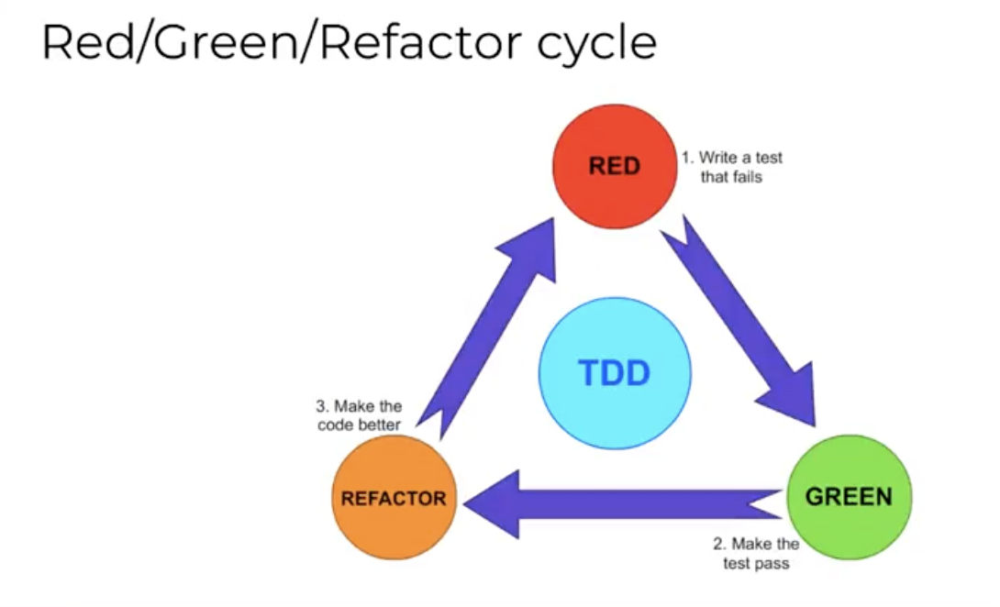

# Testing

### Software Testing

Testing is crucial to software development of any kind. Adequate test coverage is the responsibility of developers, even when there is a dedicated Quality Assurance team.

Testing ensures that the application is:
- Functional - meets all requirements.
- Usable - easy to use and the interface is intuitive.
- Reliable - doesn't break if unexpected or invalid input is provided.
- Scalable - performs well under expected load.
- Secure - protects user data from exposure.

#### Functional Testing

Functional testing verifies that an application's functions execute without errors.

Examples:
- Unit testing
- Integration testing
- Smoke testing
- End-to-end testing
- Regression testing
- Acceptance testing

##### Unit Testing

- Initiated at start of the development process (Test Driven Development).
- Automated tests of deterministic behaviour of individual functions.
- Constantly updated for bug fixes, new features, and code refactoring.
- Tools - Ruby -> Rspec, MiniTest, or TestUnit
- Tools - Javascript -> Mocha or Jest

##### Integration Testing

- Usually done early in the development process like Unit Testing.
- Tests that units work together as expected (hence, Integration).
- Incorporate testing of environment - network, environment variables, database. Making sure they're cohesive.
- If unit tests are sufficient, failures indicate issues in the environment or infrastructure or how the application is using those resources.
- Same testing libraries for unit tests.

##### End-to-end System Testing

- Comprehensive integration testing for entire application processes (end to end).
- Tests front-end and back-end code.
- Tests that **entire** user scenarios perform as expected.
- Testing frameworks include **Selenium** and **Cypress**.

##### Acceptance Testing (Stakeholders)

- Final step of functional testing performed by **stakeholders**.
- Verifies that **definition of done** criteria have been met i.e. all agreed upon requirements have been delivered.
- Often performed by Quality Assurance team as well.
- Combines automated and manual testing.

##### Nonfunctional Testing

- Nonfunctional testing used to verify other aspects of the application:
    - Usability
    - Performance
    - Security
- Examples of nonfunction testing include:
    - UI/UX testing
    - Accessibility testing
    - Performance testing
    - Internationalisation testing
    - Security testing
    - Disaster recovery testing

##### Usability Testing
Tests user experience. This testing can begin as soon as the user interface prototype is available. Happens at every part of an iterative development process during the design phase. Done by end user target audience. Used to identify missing or inadequate user interface.

##### Manual vs Automated Testing
A combination of manual and automated testing is always used. Most but not all tests can be automated.
There will always be a **tradeoff** between effort required to write and maintain automated tests and the effort required for manual testing. Finding the **balance** between the two is the key to adequate test coverage and delivering on time. It is important to always **document results**.

**Automated Testing Benefits:**
- Manual testing can be onerous and may not be consistent or reliable enough for a commercial product.
- Well-written automated tests provide a faster and more reliable way of testing the application.
- Automated tests can be used in continuous integration and continuous deployment (CI/CD).
- Automated tests increase developer confidence in making changes. Developers can run them quickly to determine if any adjustments have caused expected results to deviate.

**Automated Testing Challenges:**
- Automated tests are code => They increase the amount of code that has to be written and maintained for an application.
- Effective test writing takes skill and requires time and energy investment.
- Automated tests can lead to false confidence if new scenarios emerge and tests have not been well maintained.

#### Developer Responsibilities

Developers are expected to:
- Identify testing requirements
- Write automated tests
- Write manual test cases
- Execute tests
- Document results
- Review tests with code review
- Maintain tests

#### Documenting Test Results

- Test results are not useful if not documented properly.
- Documentation of test results may be required for **International Standards Organisation** compliance.
- Automated tests should be **self-documenting**.
- Manual tests require rigid process to ensure results are consistently documented.
- Various tools available for documenting manual tests - spreadsheets, wikis, Confluence.

#### Reviewing Tests

- Reviewing tests should be part of **code reviews**.
- When code is submitted for review, it should contain **tests and test results** for evaluation as well.
- Additional tests should definitely be included for **new features** introduced and to detect **bugs** that have been fixed by other teams.
- Often, code changes can be rejected if adequate testing has not been performed or submitted.

#### Maintenance

- Tests need constant updates and maintenance or they may inspire **false confidence**.
- Tests should be updated when:
    - New features implemented.
    - Bugs discovered.

### Test Driven Development

In test driven development, tests are written **before** the code.
The initial test is written to **fail** because there is no code.
Then, the code is written until the test *passes*.

#### Red Green Refactor Cycle

1. Red - Write tests that fail. Start by writing a test for the code you will write. Call the function in your test with various input and confirm the expected output. Remember to test edge cases.
2. Green - Make the tests pass. Write just enough code to make the tests pass.
3. Refactor - Make the code better. Refactor to make the code DRY, modular, efficient and performant. Make sure the tests still pass.
4. Repeat

#### Benefits of TDD

- Ensures that our code is testable.
- Helps ensure that code changes don't break existing functions (code **regressions**). Regression => code that was working, released, and subsequently broken. The worst kind of bug.
- Encourages thinking through the implementation before writing code.
- Provides a feedback loop.
- Helps focus on working code before refactoring to make pretty code (keeps project on schedule).

#### When should TDD be used?

TDD is proven to produce quality applications, though it takes an initial time investment to write, maintain, and run the tests.
It's also **not practical** to use TDD for **all parts** of the application, and for **all types** of testing.

TDD is most applicable for **functional** testing - particularly **unit** and **integration** testing, but can also be used for **end-to-end** testing.

It can be used for implementing new features and bug fixes.